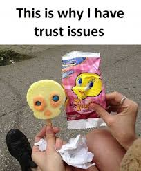

Custom exceptions
-----------------


### You can make your own exception classes

+ You don't have to extend/implement anything
  - other languages require that you extend `Exception`
+ but it's recommend to extend from either:
  - [`Exception`](https://api.dart.dev/stable/2.8.4/dart-core/Exception-class.html)
    * OK to catch these, and sometimes, they are the only way
  - [`Error`](https://api.dart.dev/stable/2.8.4/dart-core/Error-class.html#:~:text=description-,Error%20class,case%20of%20a%20program%20failure.&text=These%20are%20not%20errors%20that,may%20be%20the%20safest%20response.)
    * nobody should catch these, should not happen with good coding
+ setters can `throw` exceptions rather than adjusting values to a valid value
  ([Dart Codelab example](https://dart.dev/codelabs/dart-cheatsheet#code-example-6))


### Design by Contract vs Defensive Programming

* [Design by Contract](https://en.wikipedia.org/wiki/Design_by_contract) Wikipedia article
  - you **trust** teammates to use your class properly
* [Defensive Programming](https://en.wikipedia.org/wiki/Defensive_programming) Wikipedia article
  - you **don't trust** people to use your class properly
  <li style="list-style-type: none">
    <div style="display: flex; align-items: center;">
      
      <p style="margin-left: 32px;">
        Library authors usually design their classes defensively.  There's a higher chance that
        libraries are misused, not just pub.dev, but in other languages.
      </p>
    </div>  
  </li>


### Setters + defensive programming

```dart [1-9 | 11-17 | 19-30 | 34-38]
class InvalidPriceException implements Exception {
  final double price;

  InvalidPriceException(this.price);

  @override
  String toString() => 
    'Price must be greater than 0, $price given.';
}
 
class Product {
  String description;
  double _price;
 
  Product({ this.description, double price }) {
    this.price = price; // reuses the setter
  }
 
  set price(double price) {
    if (price <= 0) {
      throw InvalidPriceException(price);
    }
 
    _price = price;
  }
 
  double get price => _price;
 
  @override
  String toString() => '$description: $price';
}
 
// main.dart
void main() {
  final good = Product(description: 'Dog shampoo', price: 149);
  final bad = Product(description: 'Airpods', price: -2400);
  print('${good}, ${bad}');
}
```

<pre style="overflow: hidden; font-size: 0.47em" class="fragment"> 
Unhandled exception:
Price must be greater than 0, -2400.0 given.
#0      Product.price= (file:///home/michael/Documents/summer2020-se1223/error-handling/foo.dart:21:7)
#1      new Product (file:///home/michael/Documents/summer2020-se1223/error-handling/foo.dart:16:10)
</pre>


### Catching misuse of `Product`

```dart
void main() {
  try {
    stdout.write('Enter description: ');
    final description = stdin.readLineSync();
    stdout.write('Enter price: ');
    final price = double.parse(stdin.readLineSync());
    print(Product(description: description, price: price));
  } on InvalidPriceException catch (exception) {
    print(exception);
  }
}
```

<pre style="font-size: 0.5em">
Enter description: sky
Enter price: 300
sky: 300.0

Enter description: sky
Enter price: -40
Price must be greater than 0, -40.0 given.
</pre>