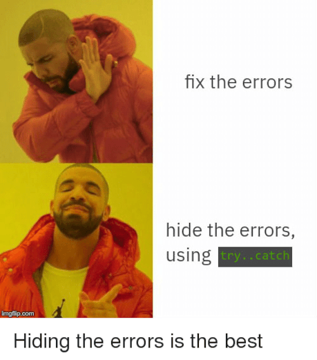

Handling and Preventing Errors without `try-catch`
--------------------------------------------------


### `try-catch` \

You can see [this](https://softwareengineering.stackexchange.com/a/107760) and 
[this](https://stackoverflow.com/questions/5440107/good-reasons-to-avoid-using-try-catch-statements)

* Code that's difficult to reason about is harder to maintain (enhance, debug, refactor)
  - which code inside the `try` block throws an error
  - which lines get skipped?
  - which lines can be moved outside the `try` block?
  - why are we catching 4 kinds of exception?
* Don't use `try-catch` like control-flow statements
  - that's an [antipattern](https://softwareengineering.stackexchange.com/questions/189222/are-exceptions-as-control-flow-considered-a-serious-antipattern-if-so-why), 
    they aren't meant for that
  - especially `___-Error`s, they should **NEVER** happen


### Avoid these lazy ninja moves (1/4)


### Avoid these lazy ninja moves (2/4)

- Don't do this everywhere
  * some may not even throw exceptions
  * hard to pinpoint lines that do
  * ideally only one line inside `try`

```dart
try {
  // all
  // lines
  // of 
  // code
  // in
  // your
  // method
} catch (any) {
  print('Something wrong: ${any}');
}
```


### Avoid these lazy ninja moves (3/4)




### Avoid these lazy ninja moves (4/4)

- [Error hiding (a.k.a. exception swallowing)](https://en.wikipedia.org/wiki/Error_hiding)
  * one reason could be laziness or time pressure
  * lack of understanding (dunno why there is an exception)
  * make the app _"presentable"_ (e.g. final defense, pitching)

```dart
try {
  // all
  // lines
  // of 
  // code
  // in
  // your
  // method
} catch (any) {
  // do nothing
}
```


### Refactoring our code without `try-catch`


### Yes, no `try-catch`

And nope, `tryParse` is just the name of the method.

```dart
import 'dart:io';
 
class Household {
  String headName;
  int headCount;
  bool masksReceived = false;
 
  Household(this.headName, this.headCount);
}
 
void main() {
  print('FREE MASKS FOR THOSE IN NEED, REGISTER HERE');
  var totalPersonCount = 0;
  final households = &lt;Household&gt;[];
 
  print('Enter -1 to stop registration.');
  while (true) {
    stdout.write('Enter name of household head: ');
    final head = stdin.readLineSync();
 
    if (head == '!') break;
 
    stdout.write('How many members in your household? ');
    final headCount = int.tryParse(stdin.readLineSync());

    if (headCount == null) {
      print('${exception.source} is not a number.');
      print('Registration failed for ${head}.');
    }
    else {
      totalPersonCount += headCount;

      households.add(Household(head, headCount));
      stdout.write("Recipient's registration ref. #: ");
      print('RR #${households.length}');
    }
  }
 
  print('\n*** REGISTRATION HAS BEEN ENDED ***');
  stdout.write('How many masks do we have so far? ');
  var totalMasks = int.tryParse(stdin.readLineSync());
  var masksPerPerson = 0;

  while (totalMasks == null || totalMasks &lt;= 0) {
    print('Total mask count should be a positive number.');
    totalMasks = int.tryParse(stdin.readLineSync());    
  }

  if (totalPersonCount == 0) {
    print('Just donate the masks, nobody wants it.');
    exit(1);
  }

  masksPerPerson = totalMasks ~/ totalPersonCount;  
  stdout.write('Each household member will get ');
  print('$masksPerPerson pieces.\n');
 
  print('GET YOUR MASKS, PLS. STAY 1M FROM EACH OTHER');
  var claimCount = 0;
 
  while (claimCount < households.length) {
    stdout.write('Enter RR#: ');
    final refNumber = int.tryParse(stdin.readLineSync());

    if (refNumber == null) {
      print('Ensure that reference number is numeric.');
      continue; // we can have continue instead of else
    }

    if (refNumber &lt; 1 || refNumber &gt; households.length) {
      print('Reference numbers are between 1 and ' + 
            '${households.length} only.');
      continue;
    }

    final household = households[refNumber - 1];
    print('Request ID for ${household.headName}.');

    if (!household.masksReceived) {
      final give = masksPerPerson * household.headCount;
      print('Give $give pcs. to recipient.');
      print('--- Masks donated by Sen. Bong Go ---');
      household.masksReceived = true;
      claimCount++;
    } else {
      print('*** DOUBLE CLAIMING IS PUNISHABLE BY LAW');
    }
  }
}
```


### non-numeric head count handled

<pre style="font-size: 0.5em">
FREE MASKS FOR THOSE IN NEED, REGISTER HERE
Enter -1 to stop registration.
Enter name of household head: Nanadaime Hokage
How many members in your household? qwer
Please enter a number.
Registration failed for Nanadaime Hokage.
Enter name of household head: Tenten
How many members in your household? 1
Recipient's registration ref. #: RR #1
Enter name of household head: Baboy Lechon
How many members in your household? 3
Recipient's registration ref. #: RR #2
Enter name of household head: !

*** REGISTRATION HAS BEEN ENDED ***
How many masks do we have so far? 40
Each household member will get 10 pieces.

GET YOUR MASKS, PLS. STAY 1M FROM EACH OTHER
Enter RR#: 2
Request ID for Baboy Lechon.
Give 30 pcs. to recipient.
</pre>


### Mask count is non-numeric

<pre>
*** REGISTRATION HAS BEEN ENDED ***
How many masks do we have so far? asdf
Pls. enter a positive number for total mask count.
-2
Pls. enter a positive number for total mask count.
400
Each household member will get 44 pieces.
</pre>

[Discuss](https://canvas.instructure.com/courses/2109863/discussion_topics/9475101) what would happen if we wrote

```dart
while (totalMasks &lt;= 0 || totalMasks == null) {
```

rather than

```dart
while (totalMasks == null || totalMasks &lt;= 0) {
```


### We handled range errors as well

<pre>
GET YOUR MASKS, PLS. STAY 1M FROM EACH OTHER
Enter RR#: haha
Ensure that reference number is numeric.
Enter RR#: 30
Reference numbers are between 1 and 3 only.
Enter RR#: -2
Reference numbers are between 1 and 3 only.
Enter RR#: 3
Request ID for Harry Roque.
Give 176 pcs. to recipient.
--- Masks donated by Sen. Bong Go ---
Enter RR#: 3
Request ID for Harry Roque.
*** DOUBLE CLAIMING IS PUNISHABLE BY LAW
Enter RR#: 2
Request ID for Mike Coo.
Give 88 pcs. to recipient.
--- Masks donated by Sen. Bong Go ---
</pre>


### We handled zero registrants

<pre>
FREE MASKS FOR THOSE IN NEED, REGISTER HERE
Enter -1 to stop registration.
Enter name of household head: !

*** REGISTRATION HAS BEEN ENDED ***
How many masks do we have so far? 300
Just donate the masks, nobody wants it.
</pre>

 <!-- .element class="fragment" -->


### `try-catch` is useless isn't it?


### Not really, let's do a case study: file-handling

* Note that for most applications, we should avoid methods that end with `Sync`
  - especially with Flutter and Web backends
* But since you're freshmen, let's focus on methods that have a `-Sync` suffix
  - we don't have to discuss the `Future` _"data structure"_
  - not really difficult 😁, especially with `async/await`
  - but still better if you understand how they're [desugared](https://www.collinsdictionary.com/dictionary/english/desugar)


#### What can go wrong when reading files?

* File does not exist
  - that seems easy, use an `if`-statement!

```dart
import 'dart:io';

void main() {
  final file = File('debt.txt');

  if (!file.existsSync()) {
    print('⚠ ${file.path} does not exist.');
    exit(1);
  }

  final lines = file.readAsLinesSync();

  for (final line in lines) {
    final parts = line.split(' ');
    final debtor = parts.first;
    final amount = parts.last;
    print('$debtor owes me $amount Php');
  }
}
```


### Looks like it works

<pre>
$ cat debt.txt  # show file contents first
kenneth 500
dominic 17
karms 95
rogi 320

$ dart demo.dart
kenneth owes me 500 Php
dominic owes me 17 Php
karms owes me 95 Php
rogi owes me 320 Php

$ mv debt.txt wrong-filename-utang.txt

$ ls
foo.dart  demo.dart  wrong-filename-utang.txt

$ dart demo.dart
⚠ debt.txt does not exist.
</pre>


### This time, it's different, File I/O is not that simple

* A lot can happen between the few µs gap between...
  - the `if (!file.existsSync()) {` check, and
  - `final lines = file.readAsLinesSync();`
* What if it exists, and **before** reading the files...
  - it got corrupted by a failing hard drive
  - some malware/hacker/you deleted it (un)intentionally
    + or it gets renamed _(it has the same effect)_
  - you pulled out the Flash drive in your rush
  - an admin user altered file permissions


### Demo time

<ul>
  <li class="fragment">
    <span>check <code>debt.txt</code> exists</span>
    <span style="color: green" class="fragment">✔</span>
  </li>
  <li class="fragment">yes, it exists.  Let's read that file next</li>
  <li class="fragment">
    one of those nasty things above happens
    <ul>
    <li class="fragment">
      <span>malware deletes file</span>
      <span style="color: blue" class="fragment">😢</span>
    </li>
    </ul>
  </li>
  <li class="fragment">
    <code>`file.readAsLinesSync()</code> throws a
    <a href="https://api.dart.dev/stable/2.9.0/dart-io/FileSystemException-class.html">
      <code>FileSystemException</code>
    </a>
    <span style="color: skyblue" class="fragment">😱</span>
  </li>
  <li class="fragment">
    Hopefully this gives you an intuition that the <i>simpler</i> <code>if</code>-statements here 
    will not work
    <ul class="fragment">
    <li>
      In fact, I wrote a <i>"malware"</i> 😁 to delete debt.txt when it gets checked for existence 😁
    </li>
  </li>
</ul>


### Unwanted things can bypass our `if`-statement

<pre style="overflow: hidden">
$ ls -lh  # just making sure debt.txt exists
total 12K
-rw-r--r-- 1 michael michael   41 Aug  2 23:49 debt.txt
-rw-r--r-- 1 michael michael  407 Aug  3 00:14 demo.dart
-rw-r--r-- 1 michael michael 2.5K Aug  2 22:55 foo.dart

$ dart demo.dart
Unhandled exception:
FileSystemException: Cannot open file, path = 'debt.txt' (OS Error: No such file or directory, errno = 2)
#0      _File.throwIfError (dart:io/file_impl.dart:645:7)
#1      _File.openSync (dart:io/file_impl.dart:489:5)
#2      _File.readAsBytesSync (dart:io/file_impl.dart:549:18)
#3      _File.readAsStringSync (dart:io/file_impl.dart:594:18)
#4      _File.readAsLinesSync (dart:io/file_impl.dart:600:36)
#5      main (file:///home/michael/Documents/summer2020-se1223/error-handling/demo.dart:12:22)
#6      _startIsolate.<anonymous closure> (dart:isolate-patch/isolate_patch.dart:301:19)
#7      _RawReceivePortImpl._handleMessage (dart:isolate-patch/isolate_patch.dart:168:12)
</pre>


### The proper way:  `try-catch`!

```dart
import 'dart:io';

void main() {
  final file = File('debt.txt');

  try {
    final lines = file.readAsLinesSync();

    for (final line in lines) {
      final parts = line.split(' ');
      final debtor = parts.first;
      final amount = parts.last;
      print('$debtor owes me $amount Php');
    }
  } on FileSystemException catch (exception) {
    print('Something went wrong: ${exception.message}');
    print('Something went wrong: ${exception.osError}');
  }
}

/*
$ ls -lh # just checking debt.txt is here (and OK permissions)
total 12K
-rw-r--r-- 1 michael michael   41 Aug  2 23:49 debt.txt
-rw-r--r-- 1 michael michael  503 Aug  3 00:26 demo.dart
-rw-r--r-- 1 michael michael 2.5K Aug  2 22:55 foo.dart

$ dart demo.dart
Something went wrong: Cannot open file
Something went wrong: OS Error: No such file or directory, errno = 2
*/
```

Oh look!  `try-catch` is not useless!


### Disabling the malware

<pre>
$ ls -lh
total 12K
-rw-r--r-- 1 michael michael   41 Aug  2 23:49 debt.txt
-rw-r--r-- 1 michael michael  503 Aug  3 00:32 demo.dart
-rw-r--r-- 1 michael michael 2.5K Aug  2 22:55 foo.dart

$ cat debt.txt
kenneth 500
dominic 17
karms 95
rogi 320

$ dart demo.dart
kenneth owes me 500 Php
dominic owes me 17 Php
karms owes me 95 Php
rogi owes me 320 Php
</pre>