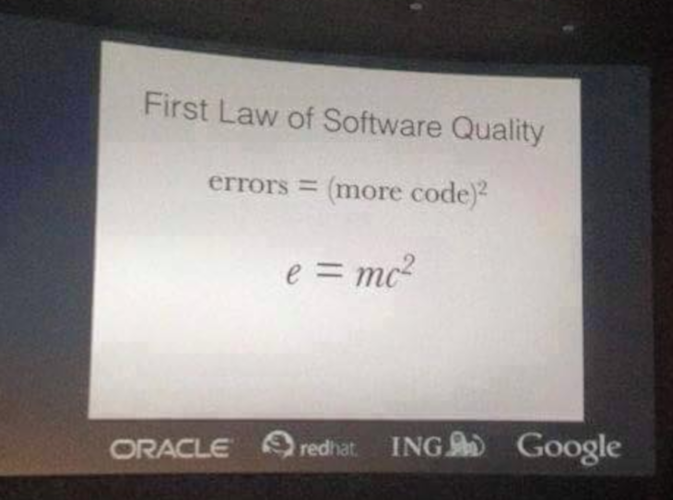

Regular Expressions
-------------------

#### _Optional Topic_


### Regular Expressions

* Regex, or Regexp for short
  - Dart calls them [RegExp](https://api.dart.dev/stable/2.9.0/dart-core/RegExp-class.html)
* patterns of text
  - e.g. `*` represents _"whatever"_.txt when deleting all text files
  
```bash
$ ls -lh
total 12K
-rw-r--r-- 1 michael michael   41 Aug  2 23:49 debt.txt
-rw-r--r-- 1 michael michael  470 Aug  3 00:32 demo.dart
-rw-r--r-- 1 michael michael 2.5K Aug  2 22:55 foo.dart
-rw-r--r-- 1 michael michael    0 Aug  3 00:55 miyaw.txt

$ rm -v *.txt
removed 'debt.txt'
removed 'miyaw.txt'
```


### `*.txt` is a pattern

* some text, followed by a dot, then a **t**, **x**, and then a **t**
  - `foolish.txt` matches the pattern
  - `grr.latxt` doesn't match
  - `picture.jpg` doesn't match
  - `assignment.txt` matches
  - `lab.dart.txt` matches
* regular expressions are patterns on steriods
  - what makes these expressions regular?
    + term comes from mathematical concept of the same name
    + if you shift to BSCS 😁, it's discussed in-depth in Automata Theory
    + kidding...don't shift, take masters in CS instead 😁


### Regex crash course

* It's a mini-langauge
  - syntax is similar in **most** languages
  - PCRE-syntax (Perl-compatible regular expressions)
  - can reuse 90% of what you'll learn here in other languages
* Dart-specific info:
  - `String`s and `RegExp`s implement [`Pattern`](https://api.dart.dev/stable/2.9.0/dart-core/Pattern-class.html)
  - in some cases, `'simple'` will do instead of `RegExp('simple')`
* Crash-course, for more details, see [this site](https://www.regular-expressions.info/)
  - it doesn't have Dart-specific info, be resourceful!


### The most basic pattern

* character literals, in sequence
* cat
  + read: **c**, followed by **a**, followed by **t**
    - thank me later!
  + matches 
    - **cat** <span style="color: green">✔</span>
    - **cat**astrophe <span style="color: green">✔</span>
    - con**cat**enate <span style="color: green">✔</span>
  + won't match
    - **C**atanduanes <span style="color: red">❌</span> (regexes case-senstive by default)
    - cartwheel <span style="color: red">❌</span>
    - basic attitude <span style="color: red">❌</span>


### In Dart code

```dart
void main() {
  final regex = RegExp('cat');

  showMatch(regex, 'cat');
  showMatch(regex, 'catastrophe');
  showMatch(regex, 'intoxicate');
  showMatch(regex, 'Catanduanes');
  showMatch(regex, 'basic attendance');
}

void showMatch(RegExp regex, String input) {
  print("$input: ${regex.hasMatch(input)}");
}
```

<pre style="font-size: 0.55em">
cat: true
catastrophe: true
intoxicate: true
Catanduanes: false
basic attendance: false
</pre>


### Scam: 1+1 isn't working

```dart
void main() {
  final regex = RegExp('1+1');

  showMatch(regex, '1+1');
  showMatch(regex, '111111111');
}

void showMatch(RegExp regex, String input) {/* ... */}
```

<pre>
1+1: false
111111111: true
</pre>

* the plus (\+) symbol is a metacharacter <!-- .element style="font-size: 0.9em" -->
  + metadata is data about the data
  + metagame is game about the game
  + \+ means _"one or more"_ (one or more 1s followed by a 1)


### Metacharacters should be escaped to erase special meaning

```dart
void main() {
  final regex = RegExp('1\\+1');

  showMatch(regex, '1+1');
  showMatch(regex, '111111111');
}
```

<pre>
1+1: true
111111111: false
</pre>

* But why two backslashes (`\`)?
  - `\+` is not an escape sequence, and gets interpreted as `+`
  - `print('\+\+');` just prints `++`
  - `\\` is the escape sequence for a single backslash


### Easier life with `r"aw strings"`

* strings prefixed with `r` are raw
  - `\`s don't escape anything
    + `print('c:\notes-in-SE')` yields **c:\notes-in-SE**
  - usually the best practice for languages that has this feature

```dart
void main() {
  final regex = RegExp(r'1\+1');

  showMatch(regex, '1+1');
  showMatch(regex, '111111111');
}
```

<pre>
1+1: true
111111111: false
</pre>


### There are 14 metacharacters

<div style="display: flex">
<ul>
  <li>[ opening square bracket</li>
  <li>{ opening curly bracket</li>
  <li>( opening round bracket</li>
  <li>. the dot</li>
  <li>+ the plus sign</li>
  <li>^ the caret</li>
  <li>| the vertical pipe</li>
</ul>
<ul style="margin-left: 64px">
  <li>] closing square bracket</li>
  <li>} closing curly bracket</li>
  <li>) closing round bracket</li>
  <li>* the asterisk</li>
  <li>? the question mark</li>
  <li>$ the dollar</li>
  <li>\ the backslash</li>
</ul>
</div>


### The two square brackets

* represents a character class
  - everything inside the bracket is an **OR**
  - it represents just **one character**
  - `[aeiou]` means **an** a, e, i, o, or u
  - in the example **g**, followed by **r**, then an **[a OR e]**, then **y**

```dart
void main() {
  showMatch(RegExp(r'gr[ae]y'), 'my gray shirt');
  showMatch(RegExp(r'gr[ae]y'), 'my grey cat');
  showMatch(RegExp(r'gr[ae]y'), 'so graeyish!');
}
```

<pre>
my gray shirt: true
my grey cat: true
so graeyish!: false
</pre>


### Dash can be used for ranges

* Otherwise we'd be writing 
  - `[ABCDEFGHIJKLMNOPQRSTUVWXYZ]`
  - [A-Za-z] means any letter in the **English/Roman** alphabet
    - won't match ñ, ë, 사, 랑, etc.
  - [0-9] means digit
  - [A-Za-z0-9 ] means any alphanumeric or space

```dart
void main() {
  showMatch(RegExp(r'[0-9][A-Z]'), '42G');
  showMatch(RegExp(r'[0-9][A-Z]'), 'A4');
  showMatch(RegExp(r'[0-9][A-Z]'), '200cents');
}
```

<pre>
42G: true
A4: false
200cents: false
</pre>


### The caret (^)'s first purpose:  character-class negation

* negates **EVERYTHING** inside the square brackets
  - when it's the first character
  - `[^0-9]` ➡ not numbers
  - `[^0-9A-Za-z ]` ➡ not digits, English alpha, & space

```dart
void main() {
  showMatch(RegExp(r'[^0-9]'), 'A');
  showMatch(RegExp(r'[^0-9]'), '#');
  showMatch(RegExp(r'[^0-9]'), '37');
}
```

<pre>
A: true
#: true
37: false
</pre>


### Character class shorthands (1/2)

* These start with a backslash
  - that's why backslash is a metachar
  - \d means digits ➡ `[0-9]`
    - \D (note uppercase) means **NOT** a number
  - \w means _"word characters"_ ➡ `[0-9A-Za-z_]`
    - valid chars in identifiers of most languages
    - \W means the opposite
  - \s means any whitespace ➡ `[ \t\r\n]`
    - not complete, there are other whitespaces we don't usually use
  - can be used inside `[]`
    - `[\s\d]` means a whitespace **OR** a digit
    - `[^\s\d]` means **NEITHER** whitespace NOR digit


### Character class shorthands (2/2)

```dart
void main() {
  showMatch(RegExp(r'\d\d\d'), 'hehe444hehe');
  showMatch(RegExp(r'\w\s\w'), '3\t_');
  showMatch(RegExp(r'\S\D'), 'UP');
  showMatch(RegExp(r'\d\d\d'), 'abc');
  showMatch(RegExp(r'\w\s\w'), '# A');
  showMatch(RegExp(r'\S\D'), ' 7');
  showMatch(RegExp(r'[A-Z\d]<3'), 'H&lt;3');
  showMatch(RegExp(r'[A-Z\d]<3'), '5&lt;3');
}
```

<pre>
hehe444hehe: true
3       _: true
UP: true
abc: false
# A: false
 7: false
H&lt;3: true
5&lt;3: true
</pre>


### The curly brackets `{}`

* They're quantifiers
  - `{4}` means repeated 4 times
  - `{5-10}` means repeated 5 to 10 times
  - `{3,}` means repeated 3 or more times
    + notice that it's a comma **followed by the closing curly brace**

```dart
void main() {
  showMatch(RegExp(r'AY\d{4}-\d{4}'), 'AY2020-2021'); // true
  showMatch(RegExp(r'[a-z]{5,10}'), 'haha'); // false
  showMatch(RegExp(r'[a-z]{5,10}'), 'hahaha'); // true
  showMatch(RegExp(r'[a-z]{5,10}'), 'hahahahaha'); // true
  showMatch(RegExp(r'\d{2,}'), '3'); // false
  showMatch(RegExp(r'\d{2,}'), '34'); // true
  showMatch(RegExp(r'\d{2,}'), '34567777777777777'); // true
}
```


### The round brackets `()`

* They have 2 purposes:
  - grouping (just like math)
  - capturing (technically a capturing group)
    + later topic in the slides

```dart
void main() {
  showMatch(RegExp(r'[A-Z]\d{4}'), 'B7A9G3M2');
  showMatch(RegExp(r'([A-Z]\d){4}'), 'B7A9G3M2');
  showMatch(RegExp(r'tr(ol){3,7}'), 'trololololol');
  showMatch(RegExp(r'tr(ol){3,7}'), 'troltroltrol');
}
```

<pre>
B7A9G3M2: false
B7A9G3M2: true
trololololol: true
troltroltrol: false
</pre>


### The dot `.`

* It means any character except newline (by default)
  - shorthand for `[^\r\n]` _(ish)_
  - commonly misused metacharacter
    + can lead to regex that are slower (not something you'll notice)
    + benchmark it against large strings as an experiment
  - remember that `A.Y.` means:
    + A, followed by any char, then Y, then any char
    + `A.Y.` matches because a `.` is any character
    + `AIYA` matches too coz' it matches the pattern
    + you might mean `A\.Y\.`
    + ☝ can also write `A[.]Y[.]` _(dots inside `[]` means literal dot)_


#### The plus, asterisk, & question mark `+ * ?`

* They're quantifier shorthands
  - \* means 0 or more `{0,}`
  - \+ means 1 or more `{1,}`
  - ? means 0 or 1 `{0,1}`
    + in essence it makes something optional

```dart
showMatch(RegExp(r'(ha)+'), 'ha'); // true
showMatch(RegExp(r'(ha)+'), 'haha'); // true
showMatch(RegExp(r'(ha)+'), 'hahahahahaha'); // true
showMatch(RegExp(r'(ha)+'), 'hehe'); // false
showMatch(RegExp(r'colou?r'), 'color'); // true
showMatch(RegExp(r'colou?r'), 'colour'); // true
showMatch(RegExp(r'colou?r'), 'colur'); // false
showMatch(RegExp(r'(ha)*'), 'laughing'); // true
showMatch(RegExp(r'(ha)*'), ''); // true
showMatch(RegExp(r'(ha)*'), 'lol hahaha'); // true
```


### The caret and dollar `^ $`

* They match positions, rather than actual characters
  - `^` means the start of tring _"(starts with)"_
    + second purpose of caret
  - `$` means the end of string _"(ends with)"_
  - `^$` means exactly
* Our regex until now are _"contains"_
  - `RegExp('cat')` matches **cat**
  - it also **cat**astrophe, va**cat**e
    + usually not what we want
  - `RegExp('^cat$')` matches cat alone
    + read as start of string, then a **c**, **a**, **t**, then end of string


### Regex by default is _contains_

```dart
showMatch(RegExp(r'09\d{9}'), '09192233445');
showMatch(RegExp(r'09\d{9}'), 'my # is 09192233445 :-)');
showMatch(RegExp(r'09\d{9}'), '09192233445566778899');
showMatch(RegExp(r'^09\d{9}$'), '09192233445566778899');
showMatch(RegExp(r'^09\d{9}$'), '09192233445');
showMatch(RegExp(r'Skywalker$'), 'Anakin Skywalker');
showMatch(RegExp(r'Skywalker$'), 'Luke Skywalker');
showMatch(RegExp(r'Skywalker$'), 'Rey Skywalker');
showMatch(RegExp(r'^Pres(ident)?'), 'Pres Duterte');
showMatch(RegExp(r'^Pres(ident)?'), 'President Duterte');
```

<pre style="font-size: 0.45em">
09192233445: true
my # is 09192233445 :-): true
09192233445566778899: true
09192233445566778899: false
09192233445: true
Anakin Skywalker: true
Luke Skywalker: true
Rey Skywalker: true
Pres Duterte: true
President Duterte: true
</pre>


### The vertical pipe `|`

* It means **OR**
  - it has a very low precedence
  - `^cat|dog$` doesn't mean _exactly (cat OR dog)_
  - it means (starts with cat) OR (ends with dog)
  - `^(cat|dog)$` is the code you want

```dart
// all of these are TRUE
showMatch(RegExp(r'^Pres(\.|ident)'), 'President Duterte');
showMatch(RegExp(r'^Pres(\.|ident)'), 'Pres. Duterte');
showMatch(RegExp(r'^BS(Ch?|EC?|M|S|Pkg)E$'), 'BSCE');
showMatch(RegExp(r'^BS(Ch?|EC?|M|S|Pkg)E$'), 'BSChE');
showMatch(RegExp(r'^BS(Ch?|EC?|M|S|Pkg)E$'), 'BSEE');
showMatch(RegExp(r'^BS(Ch?|EC?|M|S|Pkg)E$'), 'BSECE');
showMatch(RegExp(r'^BS(Ch?|EC?|M|S|Pkg)E$'), 'BSME');
showMatch(RegExp(r'^BS(Ch?|EC?|M|S|Pkg)E$'), 'BSPkgE');
showMatch(RegExp(r'^BS(Ch?|EC?|M|Pkg|S)E$'), 'BSSE');
```


### The backslash `\`

* We've discussed its purposes in the previous slides, but to review:
  - Escapes metacharacters
    + `1\+1` would match `221+134`
  - Forms character class shorthands
    + `\s`, `\w`, `\d`, etc.
  - They form a special meaning in regex, and also in the programming language you're using
    - without raw strings, e.g. [Java](https://www.regular-expressions.info/java.html), we need
      four backslashes to match a single one, leading to horrible-looking regexes like:
    - `C:\\\\temp files`


### Why are regexes in this topic?

Would you rather do this?

<pre style="font-size: 0.5em">
<code class="dart hljs" data-trim data-line-numbers="1-67 | 63-67 | 11-18 | 19-24 | 25-38 | 40-41 | 42-58">
import 'dart:io';

var _introShown = false;

void main() {
  if (!_introShown) {
    print('Welcome to the CPU e-Learning chatbot');
    _introShown = true;
  }

  print('Pls. enter your name, then a slash, then course ' +
        '& year, slash, contact #:');
  final input = stdin.readLineSync();
  final parts = input.split('/');
  
  if (parts.length != 3) {
    printErrorAndStartOver('missing parts');
  } else {
    final name = parts[0];
    final courseAndYear = parts[1];
    final contactNumber = parts[2];

    if (name.trim().isEmpty) {
      printErrorAndStartOver('blank name');
    } else {
      final parts = courseAndYear.trim().split('-');
      final course = parts.first;
      final year = int.tryParse(parts.last);
      var valid = false;

      if (course.substring(0, 2) == 'BS') {
        if (['CE', 'ChE', 'EE', 'ECE', 'ME', 'PkgE', 'SE']
            .contains(course.substring(2))) {
          if (year != null && year &gt;= 1 && year &lt;= 4) {
            valid = true;
          }
        }
      }

      if (!valid) {
        printErrorAndStartOver('invalid course and year');
      } else {
        if (contactNumber.trim().startsWith('09')) {
          final remaining = contactNumber.trim().substring(2);

          if (remaining.length == 9) {
            for (var i = 0; i &lt;code remaining.length; i++) {
              if (!'0123456789'.contains(remaining[i])) {
                printErrorAndStartOver('invalid contact #');
              }
            }

            print("Hello $name, please ask your questions!");
          } else {
            printErrorAndStartOver('invalid contact #');
          }
        }
      }
    }
  }
}

void printErrorAndStartOver(String reason) {
  print("Invalid format ($reason), please try again.");
  main();
  exit(0);
}
</code>
</pre>


#### It works

<pre style="font-size: 0.45em">
# HAPPY PATH #
Welcome to the CPU Engg e-Learning chatbot
Pls. enter your name, then a slash, then course & year, slash, contact #:
Richard Michael Coo / BSSE-2 / 09191434455
Hello Richard Michael Coo , please ask your questions!

# SAD PATHS #
Welcome to the CPU Engg e-Learning chatbot
Pls. enter your name, then a slash, then course & year, slash, contact #:
   / BSN-3 / 09194433221
Invalid format (blank name), please try again.
Pls. enter your name, then a slash, then course & year, slash, contact #:
a girl has no name / BSN-3 / 09194433221
Invalid format (invalid course and year), please try again.
Pls. enter your name, then a slash, then course & year, slash, contact #:
a girl has no name / BSPkgE-7 / 09194433221
Invalid format (invalid course and year), please try again.
Pls. enter your name, then a slash, then course & year, slash, contact #:
a girl has no name / BSPkgE-2 / 09asdfghjkl
Invalid format (invalid contact #), please try again.
Pls. enter your name, then a slash, then course & year, slash, contact #:
a girl has no name / BSPkgE-2 / 0912345678
Invalid format (invalid contact #), please try again.
Pls. enter your name, then a slash, then course & year, slash, contact #:
a girl has no name / BSECE-4 / 09123456789
Hello a girl has no name , please ask your questions!
</pre>


### It still has bugs




### Just to show one bug

<pre style="overflow: hidden">
Pls. enter your name, then a slash, then course & year, slash, contact #:
a / b / c
Unhandled exception:
RangeError: Value not in range: 2
#0      _StringBase.substring (dart:core-patch/string_patch.dart:388:7)
#1      main (file:///home/michael/Documents/summer2020-se1223/error-handling/re.dart:30:18)
#2      printErrorAndStartOver (file:///home/michael/Documents/summer2020-se1223/error-handling/re.dart:64:3)
#3      main (file:///home/michael/Documents/summer2020-se1223/error-handling/re.dart:16:5)
#4      printErrorAndStartOver (file:///home/michael/Documents/summer2020-se1223/error-handling/re.dart:64:3)
#5      main (file:///home/michael/Documents/summer2020-se1223/error-handling/re.dart:16:5)
#6      _startIsolate.<anonymous closure> (dart:isolate-patch/isolate_patch.dart:301:19)
#7      _RawReceivePortImpl._handleMessage (dart:isolate-patch/isolate_patch.dart:168:12)
</pre>

~~More entries, more chances of winning~~

More lines of code, more chances of having bugs


### Detecting bad formats with regex

<pre style="font-size: 0.41em">
<code class="dart hljs" data-trim data-line-numbers="11-13 | 14-21 | 15 | 16 | 17 | 18 | 19 | 20 | 23-38">
import 'dart:io';

var introShown = false;

void main() {
  if (!introShown) {
    print('Welcome to the CPU e-Learning chatbot');
    introShown = true;
  }
  
  print('Pls. enter your details in this format...');
  stdout.write('name / course & year / contact #: ');
  final input = stdin.readLineSync();
  final regex = RegExp(
    r'^([^/\s][^/]+)' + // NAME: not space & not /, followed by 1+ non-slashes
    r'\s*/\s*' + // 0 or more spaces SLASH 0 or more spaces
    r'(BS(?:Ch?|EC?|M|Pkg|S)E)' + // COURSE: only engineering courses
    r'-([1-4])' + // YEAR: dash then a number from 1 to 4
    r'\s*/\s*' + // 0 or more spaces SLASH 0 or more spaces
    r'(09\d{9})$' // CONTACT #: 09 followed by 9 digits
  );

  if (regex.hasMatch(input)) {
    final match = regex.firstMatch(input);
    final name = match.group(1);
    final course = match.group(2);
    final year = match.group(3);
    final contactNumber = match.group(4);

    print('Please verify your details, and ask your questons:');
    print ('Name: $name');
    print ('Course & Year: $course-$year');
    print('Contact #: $contactNumber');
  } else {
    print('Please check that you are following the correct format.');
    print('Chatbot is also exclusive to Engg students');
    main();
  }
}
</code>
</pre>

* can also capture values inside the round brackets
  - `?:` signals round brackets only for grouping, not capturing


#### Sample Run

<pre style="font-size: 0.425em">
Welcome to the CPU e-Learning chatbot
Pls. enter your details in this format...
name / course & year / contact #: / BSECE-4 / 09191234567 
Please check that you are following the correct format.
Chatbot is also exclusive to Engg students
Pls. enter your details in this format...
name / course & year / contact #: Mike Coo / BSN-3/09191234567  
Please check that you are following the correct format.
Chatbot is also exclusive to Engg students
Pls. enter your details in this format...
name / course & year / contact #: Mike Coo / BSEE-8 / 09191234567
Please check that you are following the correct format.
Chatbot is also exclusive to Engg students
Pls. enter your details in this format...
name / course & year / contact #: Mike Coo / BSChE-3 / 0919123456
Please check that you are following the correct format.
Chatbot is also exclusive to Engg students
Pls. enter your details in this format...
name / course & year / contact #: Mike Coo / BSCE-1 / 09asdfghjkl
Please check that you are following the correct format.
Chatbot is also exclusive to Engg students
Pls. enter your details in this format...
name / course & year / contact #: Mike Coo / BSME-2 / 09191234567
Please verify your details, and ask your questons:
Name: Mike Coo 
Course & Year: BSME-2
Contact #: 09191234567
</pre>


### But the errors are not detailed

* We can combine `split`, ensuring it has **3** parts, and verifying each part with regex
  - but in general, regex is **declarative**, using loops and conditionals is **imperative**
    - declarative code is _"tell computer what to do, not how"_
    - imperative code is _"tell computer how do do it, step by step"_
  - declarative code is less buggy in general
    - but super-complex regexps can be hard to maintain as well
  - feel free to combine both if it results in higher quality code
    - we can't always solve everything with 1 regex
  - regexps are **OVERKILL** in many <u>simple tasks</u>
    - it uses an engine called an automaton behind the scenes